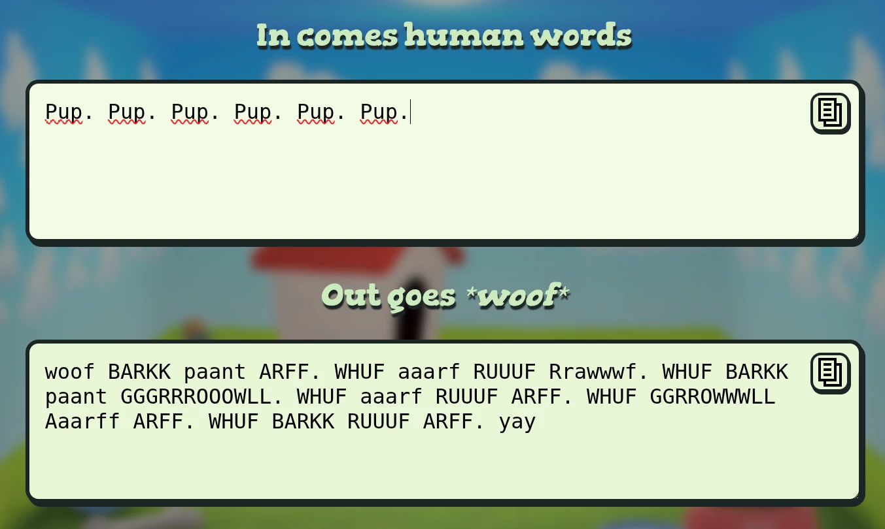

# Puplang Mechanisms

## WHY DOES IT ALWAYS START WITH `woof` AND END WITH `yay`

Well first off,, why are you yelling? 
Second of all, woof, in this format, is equivelent to a 0, so I think it's the best way to start the format. It ends with a yay because the puppy is happy! Also uhm because it is distinguishable or something.

## Wait.. woof is 0? Uh..?

In UTF-8 you follow a very simple pattern.
Each *english* character gets encoded into 128 individual values.

So, "Pup" would be: 
`50` `75` `70`.

And in `puplang`, that would be: 
`aaarf` `RUUUF` `ARFF`

But, if you've already played around with puplang you might be a bit confused by that, because you probably saw something like this:

### So... wait. How do all those different bark sounds equal the same letters? How do they equal numbers at all??

The way `puplang` stores character codes is very simple.
A list of barks with predefined max letters (runs) are stored in `settings.txt`. Each value is a continous pattern of:

Default variation (like `woof`) -> Different casing styles (like `WOOF`) -> Next word (repeat until all words are ran through) -> Add letters up to the defined count of that letter from left to right (so, `wwoof` is one value higher than `GROWL`).

This gives us.. I'd say around 10000 combinations. Which is a lot higher than we need for ASCII (english) characters.

## But how do those translate to 7-bit values?

At decode, those longer barks get wrapped back down to the 0-127 range. 
At encode, we pick candidates of equal value with a tendency for smaller values, except for one mandatory howl + 20% chance of one so each message gets a good awoooooooo.

## Unicode

For unicode, we use:
- `rr-`, for latin/greek characters (2 bytes)
- `Rr-`, for chinese/japanese characters (3 bytes)
- `Rrr-` for emoji/rare characters (4 bytes)
- `rrr-` to reset back to 1 byte

Using those prefixes puts us into multi-bark mode, or multi-byte or whatever.  
For example, here is the 🐕:  
`woof Rrr-woof Arf BAAF Huuf yay`

remove one `u` to get a friendly turtle!

Unlike in UTF-8, we don't store length in the bark itself, we use the prefix for some added cute flare. We COULD 100% store it in the bark, but I like this more.

Another design choice was to not encode dual byte characters into one bark, even though its possible a LOT of characters would turn into howls, which I don't like.

### So... that's basically all there is to it.. Uhm.. Someone should convert this into the bible or somethin