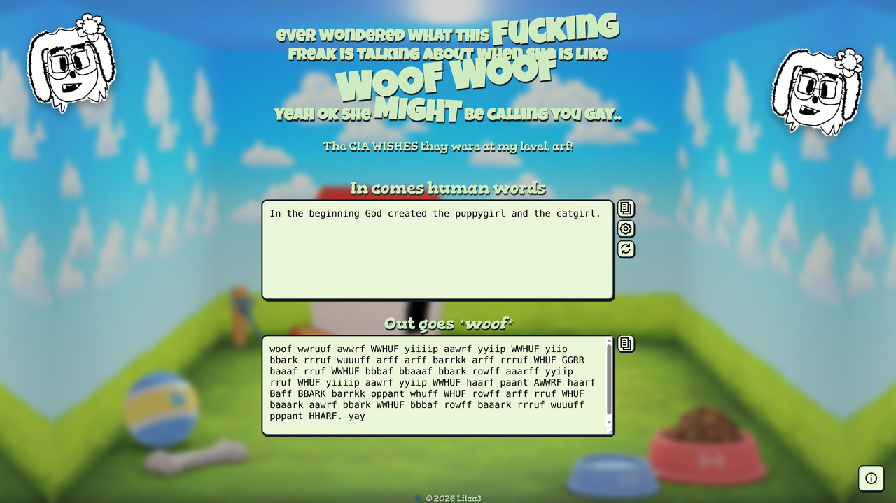
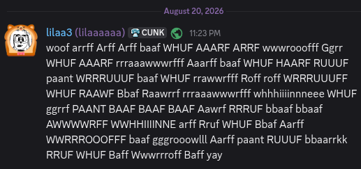

# puplang (joke between a friend that i had to make)


So you might think, Lila, why would I need to write out my messages like a dog with random howls inbetween the barks. Well.. Uhm.. Mm...

You might also be asking, how does it work! Well imagine like a discord puppygirl's brain got put into some bad cpp trying to be all modern and shit. It's like that. But very convuluted UTF-8. I can explain it like a real human being too if you want I suppose.,,

<sup>why would you ask me [to do that](MECHANISMS.md).,.</sup>

## Thirdparty

### CLI / Lib

| Library | License | Copyright |
| --- | --- | --- |
| [argparse](https://github.com/p-ranav/argparse) | [MIT License](thirdparty/argparse/LICENSE) | [© 2018 Pranav Srinivas Kumar](https://github.com/p-ranav) |
| [utfcpp](https://github.com/nemtrif/utfcpp) | [Boost Software License 1.0](thirdparty/utfcpp/LICENSE) | [© Nemanja Trifunovic](https://github.com/nemtrif) |

### Web

| Asset | License | Copyright |
| --- | --- | --- |
| [Emscripten](https://github.com/emscripten-core/emscripten) | [MIT / UIUC NCSA](web/licenses/emscripten-LICENSE.txt) | [© 2010–2014 Emscripten authors](https://github.com/emscripten-core) |
| [Flowbite Icons](https://github.com/themesberg/flowbite-icons) | [MIT License](web/licenses/flowbite-LICENSE.txt) | [© 2024 Themesberg](https://github.com/themesberg) |
| [css.gg](https://css.gg/) | [Creative Commons BY-NC-ND*](web/licenses/css-gg-LICENSE.md) | [© 2024 CSS＊GG & GLYF＊APP](https://github.com/astrit) |
| [Wolf icon (Noun Project)](https://thenounproject.com/icon/wolf-howling-521733/) | [Creative Commons Attribution 3.0](https://creativecommons.org/licenses/by/3.0/) | [© 2016 ProSymbols](https://thenounproject.com/creator/prosymbols/) |
| [Luckiest Guy](https://fonts.google.com/specimen/Luckiest+Guy) | [SIL Open Font License 1.1](web/licenses/luckiest_guy-LICENSE.txt) | [© 2011 Astigmatic](https://web.archive.org/web/20191118143728/http://www.astigmatic.com/) |
| [Gorditas](https://fonts.google.com/specimen/Gorditas) | [SIL Open Font License 1.1](web/licenses/Gorditas-OFL.txt) | [© 2011 Gustavo Dipre](https://luc.devroye.org/fonts-62486.html) |

\* CSS.GG has a custom license similar to Creative Commons BY-NC-ND, but explicitly bans making derivative works or replicating its functionality.

## License

Originally [UNLICENSE](https://unlicense.org/), now [MIT](https://en.wikipedia.org/wiki/MIT_License) for the sake of attribution and avoiding conflicts with other licenses. Argparse requires shipping with license, while utfcpp does not. I only care about source level attribution, like in boost, but I will use MIT for the sake of argparse.

The external licenses are embedded into the cli by default and are included in the website under `licenses/`.

## Building

### C++

Dependencies: [CMake](https://cmake.org/) >= 3.10 and a C++26 compiler (clang 17+ or gcc 14+).

The C++ implementation is split into a header-only core library (`lib/`)
and a command-line frontend (`cli/`). The default sound table
(`lib/default_settings.txt`) is embedded into the library at compile time
via `#embed`, so no runtime settings file is needed unless you pass one.

```sh
cmake -S . -B build
cmake --build build
```

### Web

Dependencies: [Emscripten](https://emscripten.org/) (latest), [Node.js](https://nodejs.org/) (latest), and npm (for `marked`, installed automatically via `npm install`).

```sh
npm install --prefix web
bash web/build.sh
```

## Contributing

#### why.

<sup>Clang format please and don't be a dick and don't change the standard if you aren't me.. That's all.</sup>

## Use cases

Uhm... Encrypt your messages like a terminally online trans woman. Or double encrypt them! Now even the CIA won't be able to know about the disgusting things someone would use this for. Probably.


## It can do your homework

Thats right the opposite of a dumb dog is one that speaks AND does your homework.

## Wanna disect this dog's brain?

You can dump the entire sound table straight from the CLI:

```sh
./puplang sounds -o sound_table.txt
```

It includes every word alongside its equivalent value and ASCII C representation (for example `\n` or `\u{0}` or just `A`).
You can also download it from the releases/artifacts.

## Development status

I'd really like to add stuff like.
- Binary mode: sounds funny
- ~~More optimized bark mode, similar to purrcrypt?~~
- Compression?? Not out of the question?
- ~~Versioning + a magic number.. Maybe.~~